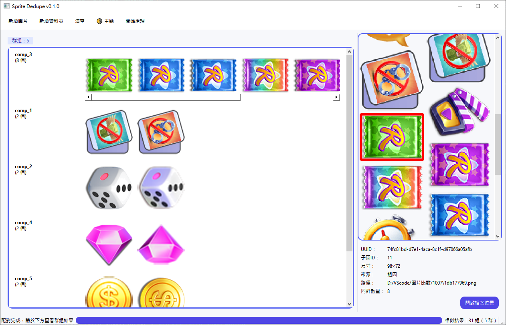

# Sprite Dedupe (Alpha-CC + pHash)

精準的圖片重複檢測與 spritesheet 子圖分群工具  
使用 Alpha-Connected Components + 多通道 pHash 技術  
支援大量遊戲素材、自動分群與母圖 bbox 標記



---

## 🚀 下載執行 (Windows)

我們提供已打包好的 `.exe` 執行檔，無需安裝 Python 環境。

1.  前往 **[GitHub Releases 頁面](https://github.com/Jasper1004/sprite-dedupe/releases)**
2.  下載最新版本的 `sprite-dedupe.Windows.exe` 檔案。
3.  下載後，直接雙擊，系統會跳出系統警告，如下圖。

4.  點選其他資訊，再點選仍要執行，如下圖。


---

## 🚀 下載執行 (MacOS)

我們提供已打包好的 `.zip` 壓縮檔，無需安裝 Python 環境。

1.  前往 **[GitHub Releases 頁面](https://github.com/Jasper1004/sprite-dedupe/releases)**
2.  下載最新版本的 `sprite-dedupe.macOS.zip` 檔案。
3.  下載後，直接雙擊將壓縮檔解壓縮
4.  之後先雙擊此 `sprite-dedupe.app`，應該會跳出下圖視窗

5.  打開「系統設定」（System Settings），前往「隱私權與安全性」（Privacy & Security），如下圖

6.  往下捲動，找到「安全性」（Security）區域，您應該會在這裡看到一行字，寫著已阻擋「"sprite-dedupe.app" 」以保護你的 Mac，請點擊右側「強制打開」，如下圖。

7.  點擊強制打開後，就能使用本系統，應該會跳出下圖視窗


---

## 🖥️ 系統需求

| 項目 | 需求 |
|------|------|
| 作業系統 | Windows 10/11 (x64) |
| RAM | 建議 ≥ 8GB |
| Python | 3.10+ |

---


## 📦 從原始碼安裝 (開發者)

### 1️⃣ 下載原始碼
**方式 A：透過 Git Clone**
```bash
git clone https://github.com/Jasper1004/sprite-dedupe.git
cd sprite-dedupe
```

**方式 B：手動下載**
> Code → Download ZIP → 解壓縮後進入資料夾

---

### 2️⃣ 建立虛擬環境
```bash
python -m venv .venv
# Windows
.venv\Scripts\activate
# macOS/Linux
source .venv/bin/activate
```

---

### 3️⃣ 安裝依賴套件
```bash
pip install -r requirements.txt
```

---

### 4️⃣ 執行圖形介面
```bash
python main.py
```

---

## ✨ 主要功能

| 功能 | 說明 |
|------|------|
| Spritesheet 自動分割 | 透過 Alpha CC 偵測子圖 bbox |
| 多通道 pHash 分群 | primary/secondary/U/V/alpha/edge channels |
| 深色/淺色主題切換 | UI 可切換 |
| 母圖標記對應位置 | 群組內顯示 bbox |
| 避免誤群組 | 雙階段特徵比對 |
| 強制標記整圖 | 手動修正被誤切的文字/物件，強制視為單張比對 |
| 結果可匯出 | JSON 格式 |

> 📌 至少兩張相似圖片才會生成一個群組  
> 📌 獨立圖片不顯示，避免干擾判讀

---

## 💡 操作技巧：處理被誤切的文字圖

若發現整句式文字（如 "Let's Go"）被系統誤判為 Spritesheet 並拆解成字母比對：

1. 執行比對後，在左側列表中點擊該錯誤群組（或點擊右側預覽圖）。
2. 點擊工具列上的 **「標記為整圖」** 按鈕（Object Group Icon）。
3. 系統會將該群組內的圖片標記為 **「強制不切割」**。
4. 再次點擊 **「開始處理」**，系統即會以整張圖進行重新比對，將其正確歸類。

---

## 📁 專案結構

```text
sprite-dedupe/
├─ app/
│  ├─ __init__.py
│  ├─ constants.py
│  ├─ core/
│  │  ├─ alpha_cc.py      # Alpha Connected Components：子圖框選
│  │  ├─ phash.py         # 多通道 pHash，比對旋轉/翻轉等變化
│  │  └─ features.py      # 直方圖、卡方距離等特徵工具
│  ├─ utils/
│  │  ├─ atomic.py        # 原子化檔案寫入
│  │  └─ image_io.py      # 去白、影像輸出與處理
│  ├─ stores/
│  │  ├─ feature_store.py # 特徵快取
│  │  ├─ index_store.py   # 檔案索引管理
│  │  └─ logger.py        # 事件記錄
│  └─ ui/
│     ├─ widgets.py       # BBoxGraphicsView、ImageLabel
│     ├─ group_widget.py  # GroupResultsWidget：分群顯示
│     ├─ dialogs.py       # PairDecisionDialog
│     └─ main_window.py   # 主視窗與 UI 控制流程
├─ main.py                # 程式入口
├─ requirements.txt
└─ README.md
```

---

## 📘 使用教學

1️⃣ 加入 spritesheet 或散圖：  
→ 點 **新增圖片** 或 **新增資料夾**

2️⃣ 點 **開始處理**：  
→ 自動偵測與分群

3️⃣ 左側顯示分群結果，右側顯示：  
   ✅ 母圖  
   ✅ bbox 標記位置  

4️⃣ 可切換深色 / 淺色主題  

5️⃣ 可調整去白參數改善背景

---

## 📝 License

MIT License  
歡迎自由開發、修改與引用本專案。
